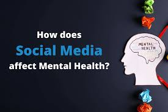

# Investigating the Correlation Between Social Media Use and Mental Health

   

This project explored the link between social media use and mental health. Analysis of survey data revealed correlations between excessive use, negative comparisons, and increased anxiety and depression. Findings suggest the importance of mindful social media practices.

---

## 📊 About

This project dives deep into the relationship between social media habits and mental well-being. By analyzing survey data, we uncover how factors like excessive use and negative social comparison correlate with increased anxiety and depression.

---

## ✨ Key Features

* **Data Cleaning & Preprocessing:** Ensuring data accuracy and consistency for reliable analysis.
* **Exploratory Data Analysis (EDA):** Unveiling patterns and insights through visualizations.
* **Statistical Analysis:**  Quantifying the relationship between social media use and mental health metrics.
* **Correlation Analysis:** Identifying key factors that contribute to mental health outcomes.

---

## 🚀 Technologies Used

  
  
  
  
  

---

## 💾 Data Source

This dataset, sourced from Kaggle ([link to Kaggle dataset](https://www.kaggle.com/datasets/souvikahmed071/social-media-and-mental-health)), was initially compiled to investigate the correlation between social media usage and mental health. It includes:

* **Demographics:** Age, gender, etc.
* **Social Media Habits:** Platforms used, time spent, etc.
* **Mental Health Measures:** Anxiety, depression, stress levels, etc.

---

## 🛠️ How to Run

1. **Clone the repository:** `git clone [your repository URL]`
2. **Download the dataset:** From the Kaggle link above and place it in the `data` folder.
3. **Install dependencies:** `pip install -r requirements.txt`
4. **Run the analysis script:** `python main.py`

---

## 📈 Results

  
   

---

## 🙌 Contributing

Contributions are welcome! Feel free to submit pull requests or open issues.

---

## 👤 Contact

https://github.com/varshitha-9
